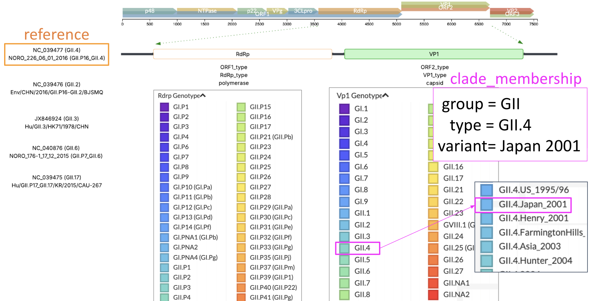

## Nextclade workflow

Previously, all "official" Nextclade workflows lived in a [central GitHub repository](https://github.com/neherlab/nextclade_data_workflows).
The new standard would be to include the Nextclade workflow within the pathogen repo.

This workflow is used to create the Nextclade datasets for this pathogen.
All official Nextclade datasets are available at https://github.com/nextstrain/nextclade_data.


## Workflow Usage

The workflow can be run from the top level pathogen repo directory:

```
nextstrain build nextclade
```

Alternatively, the workflow can also be run from within the nextclade directory:
```
cd nextclade
nextstrain build .
```

This produces the default outputs of the nextclade workflow:

- nextclade_dataset(s) = datasets/<build_name>/*


## Norovirus classification

The Nextclade datasets uses MK073894 (GII.4) as the reference to call mutations against. Diagrammed below is the placement of RdRp and VP1 in the norovirus genome. On the left are the different references used in our phylogenetic workflows on the VP1 builds (e.g. GII.2, GII.6).

Based on skimming the literature, norovirus typing has undergone multiple changes, but generally are split out into a "genogroup", "genotype", and "variant" classification for VP1 (and "P-group", "P-type" and "variant" for RdRp). Therefore, the goal was to create an initial rough Nextclade dataset for VP1 and RdRp genes to get "group", "type" and "variant" classification



### Representative strains for the scaffold tree

The representative strains for [VP1](defaults/VP1/clade_membership.tsv) and [RdRp](defaults/RdRp/clade_membership.tsv) datasets were picked by checking the following resources:

| reference | paper  | note |
| :-- | --- | --- |
| `2025cdc` | Tatusov, R.L., Chhabra, P., Diez-Valcarce, M., Barclay, L., Cannon, J.L. and Vinjé, J., 2021. [Human Calicivirus Typing tool: A web-based tool for genotyping human norovirus and sapovirus sequences](https://doi.org/10.1016/j.jcv.2020.104718). _Journal of Clinical Virology_, _134_, p.104718. | [table](https://calicivirustypingtool.cdc.gov/becerance.cgi ), accessed 2025 |
| `RefSeq` | | [list](https://www.ncbi.nlm.nih.gov/labs/virus/vssi/#/virus?SeqType_s=Nucleotide&VirusLineage_ss=Norovirus,%20taxid:142786&SourceDB_s=RefSeq), accessed 2025 |
| `2006zheng` | Zheng, D.P., Ando, T., Fankhauser, R.L., Beard, R.S., Glass, R.I. and Monroe, S.S., 2006. [Norovirus classification and proposed strain nomenclature](https://doi.org/10.1016/j.virol.2005.11.015). _Virology_, _346_(2), pp.312-323. | Table 1 |
| `2019chhabra` | Chhabra, P., de Graaf, M., Parra, G.I., Chan, M.C.W., Green, K., Martella, V., Wang, Q., White, P.A., Katayama, K., Vennema, H. and Koopmans, M.P., 2019. [Updated classification of norovirus genogroups and genotypes](https://doi.org/10.1099/jgv.0.001318). _Journal of General Virology_, _100_(10), pp.1393-1406. | Table 1 |
| `2013eden`    | Eden, J.S., Tanaka, M.M., Boni, M.F., Rawlinson, W.D. and White, P.A., 2013. [Recombination within the pandemic norovirus GII. 4 lineage](https://doi.org/10.1128/jvi.03464-12). _Journal of virology_, _87_(11), pp.6270-6282. | Table 2 of variants where asterisks marked more serious variants. |

## Defaults

The defaults directory contains all of the default configurations for the Nextclade workflow.

[defaults/config.yaml](defaults/config.yaml) contains all of the default configuration parameters
used for the Nextclade workflow. Use Snakemake's `--configfile`/`--config`
options to override these default values.

## Snakefile and rules

The rules directory contains separate Snakefiles (`*.smk`) as modules of the core Nextclade workflow.
The modules of the workflow are in separate files to keep the main nextclade [Snakefile](Snakefile) succinct and organized.

The `workdir` is hardcoded to be the nextclade directory so all filepaths for
inputs/outputs should be relative to the nextclade directory.

Modules are all [included](https://snakemake.readthedocs.io/en/stable/snakefiles/modularization.html#includes)
in the main Snakefile in the order that they are expected to run.

## Build configs

The build-configs directory contains custom configs and rules that override and/or
extend the default workflow.

- [test-dataset](build-configs/test-dataset/) - build to test new Nextclade dataset
